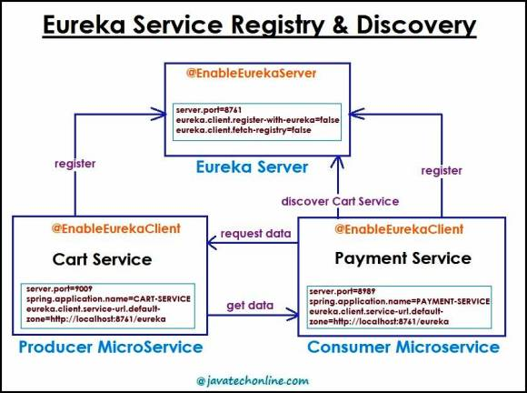

# Netflix-Eureka

## What is Netflix Eureka?
Netflix is an organization who provides various open source projects. Eureka is one of those projects that is the most commonly used for service registry & discovery in the context of Microservices. We also call it Registry & Discovery Server. It holds the details of Microservices running (Service Instance). Every Microservice, must be registered with Eureka Server. Netflix is one of the leader organizations in open source Microservices libraries that works well with Spring Boot. Among the most common projects that we use in Microservices are Eureka, Ribbon, Hystrix, Zuul projects

## What is Service Registry in Microservices?
Service Registry is the process of registering a microservice with Eureka Server. In a nutshell, it acts as a kind of database which stores the details of all microservices involved in the entire application. However, this is also a regular Spring Boot application. In order to enable the service registry, we apply annotation @EnableEurekaServer on the top of the Application’s main class. Moreover, on using Spring Cloud’s annotation @EnableEurekaServer, other microservices can register here and communicate with each other via service discovery.

## What is Service Discovery in Microservices?
Service Discovery is the process of discovering other microservices in the network to make intra-communication happen. However, a microservice first connects with Eureka to discover other microservice to make communicate with each other. Using Service Discovery, one microservice can connect with other microservice via Eureka.

## Software/Technology used in this Project
- Intellij
- JDK8 or later versions (Extremely tested on JDK8, JDK9 and JDK14)
- Spring cloud, Spring Boot, Spring Rest, Maven

## How to execute and test the whole application?
Please follow below steps to test the whole application :
1. Clone the Repository using [HTTPS](https://github.com/Tsvetoslav88/Netflix-Eureka.git) option
2. Import the three projects in our favorite IDE
3. Start the Eureka Server
4. Start the Provider Application (CartService)
5. Start the Consumer Application (PaymentService)
6. Trigger Payment Service link which is going to make a call to CardService using Eureka - http://localhost:8989/payment/data
